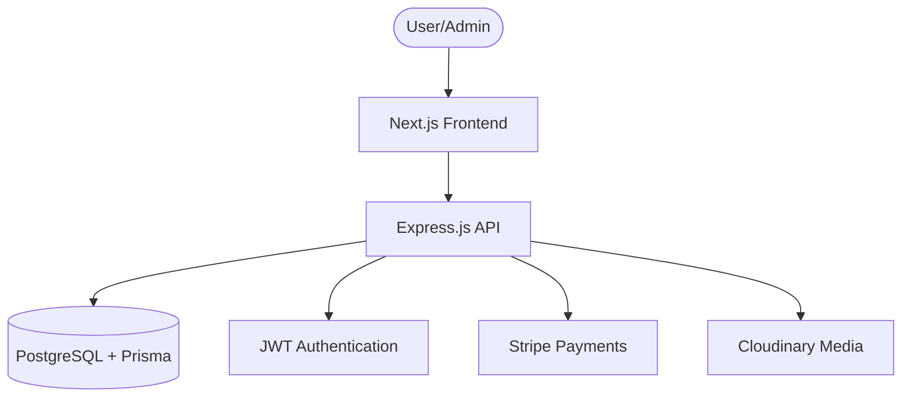

# Implementation Plan - Rejoice Events & Decor

Building a production-ready full-stack platform for event decoration booking and decor rental.

## Proposed Changes

### System Architecture

### Database Schema (Prisma)

The schema focuses on event categories, past works (gallery), inventory (decor items), and a robust booking/payment system.

#### Models:
- **User / Profile**: Authentication and user details.
- **EventCategory**: Wedding, Birthday, etc.
- **PastWork**: Portfolio gallery of previous events.
- **InventoryItem**: Decor items available for rental (tracking stock).
- **Booking / BookingItem**: Handles the reservation of items and event dates.
- **Payment**: Tracks partial and full payments via Stripe.

### REST API Endpoints

| Category | Endpoint | Method | Description |
| :--- | :--- | :--- | :--- |
| **Auth** | `/api/auth/register` | POST | Resident user registration |
| | `/api/auth/login` | POST | JWT login |
| **Categories** | `/api/categories` | GET | List all categories |
| **Gallery** | `/api/past-works` | GET | List works (filterable by category) |
| **Inventory** | `/api/inventory` | GET | List items with availability |
| **Bookings** | `/api/bookings` | POST | Create new booking |
| | `/api/bookings/check-availability` | GET | Check item/date availability |
| **Payments** | `/api/payments/create-intent` | POST | Initialize Stripe payment |
| **Admin** | `/api/admin/*` | ALL | Management routes (Protected) |

### Project Folder Structure

#### Backend
- `src/controllers/`: Request handling logic
- `src/routes/`: API route definitions
- `src/middleware/`: Auth (JWT), validation, error handling
- `src/services/`: Core business logic (Stripe, Cloudinary, Booking conflicts)
- `src/prisma/`: Prisma client and schema

#### Frontend
- `src/app/`: Next.js App Router (pages)
- `src/components/ui/`: Reusable primitive components (Button, Input)
- `src/components/sections/`: Large page sections (Hero, Gallery, BookingForm)
- `src/lib/`: API clients, utilities
- `src/hooks/`: Custom React hooks

## Development Phases

### Phase 1: MVP Foundation (Authentication & Catalog)
- Finalize schema and database setup.
- Implement JWT Auth.
- Create Admin CRUD for Categories and Past Works.
- Display "Past Works" gallery on the frontend.

### Phase 2: Inventory & Rental System
- Implement Inventory management.
- Backend logic for calculating availability based on existing bookings.
- Frontend "Catalog" with search and filters.

### Phase 3: Booking & Payments
- implement Booking flow (Calendar selection, item selection).
- Stripe integration for deposits and full payments.
- Automatic inventory status updates.

### Phase 4: Admin Dashboard & Polish
- Full management dashboard for bookings.
- Media management with Cloudinary.
- SEO, performance optimization, and premium UI animations.

## Verification Plan

### Automated Tests
- `npm test` for backend controllers.
- Check booking conflict logic with unit tests.

### Manual Verification
- Verify Stripe test payments.
- Ensure Cloudinary uploads are optimized.
- Cross-browser testing for the booking calendar.
